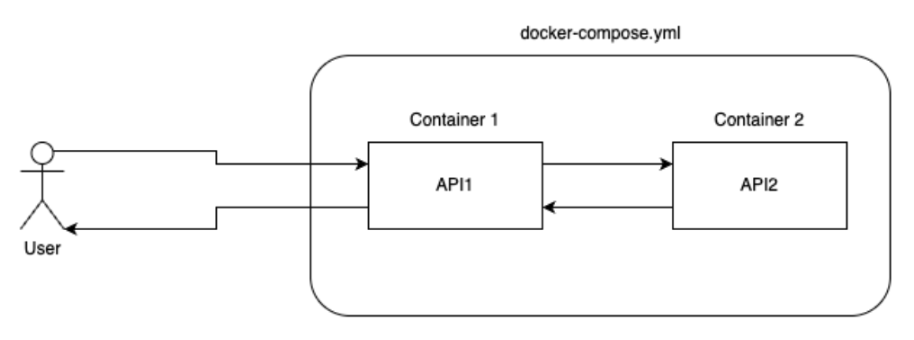
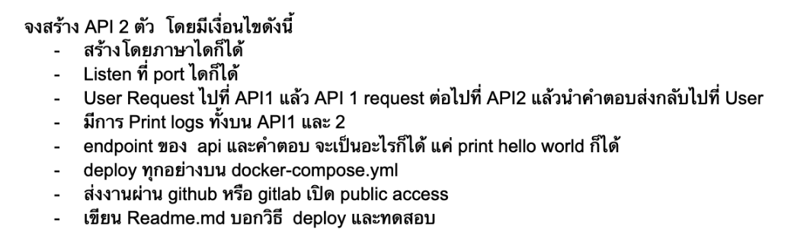
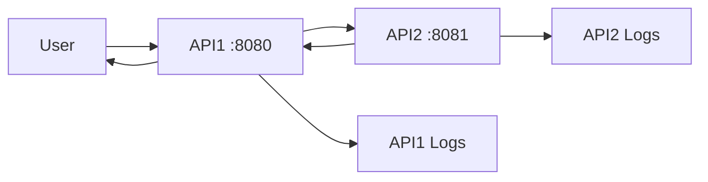

# AIForThai Hackathon 2025 Quiz





A microservices demonstration project showcasing container-to-container communication using Docker Compose. This project consists of two Rust-based API services that communicate with each other to demonstrate distributed system patterns.

## 🎯 Project Overview

This project demonstrates a simple microservices architecture where:

- **API1** acts as a gateway/frontend service
- **API2** acts as a backend service
- Users interact with API1, which internally communicates with API2
- Both services log their activities for monitoring and debugging

### Architecture Flow



## ✅ Requirements Met

- ✅ Built with Rust (modern, performant language)
- ✅ Each API listens on defined ports (8080, 8081)
- ✅ User → API1 → API2 → API1 → User communication flow
- ✅ Request logging on both services
- ✅ Custom endpoint responses ("Hello world from API 1/2")
- ✅ Deployable with `docker-compose`
- ✅ Public repository ready

## 🚀 Quick Start

### Prerequisites

- Docker
- Docker Compose

### Running the Application

1. **Clone the repository**

   ```bash
   git clone <your-repo-url>
   cd aiforthai-hackathon-2025-quiz
   ```

2. **Start the services**

   ```bash
   docker-compose up --build
   ```

3. **Test the application**
   ```bash
   curl http://localhost:8080
   ```

## 📁 Project Structure

```
aiforthai-hackathon-2025-quiz/
├── api1/                    # Frontend/Gateway service
│   ├── Cargo.toml          # Rust dependencies
│   ├── Dockerfile          # Container configuration
│   └── src/
│       └── main.rs         # API1 implementation
├── api2/                    # Backend service
│   ├── Cargo.toml          # Rust dependencies
│   ├── Dockerfile          # Container configuration
│   └── src/
│       └── main.rs         # API2 implementation
├── docker-compose.yml       # Multi-container orchestration
└── README.md               # This file
```

## 🔧 Technical Details

### API1 (Gateway Service)

- **Port**: 8080
- **Framework**: ntex (async web framework)
- **Dependencies**:
  - `ntex` - Web framework
  - `reqwest` - HTTP client for calling API2
  - `anyhow` - Error handling
- **Functionality**:
  - Receives user requests
  - Forwards requests to API2
  - Logs all activities
  - Returns combined response

### API2 (Backend Service)

- **Port**: 8081
- **Framework**: ntex
- **Dependencies**:
  - `ntex` - Web framework
- **Functionality**:
  - Provides backend services
  - Logs incoming requests
  - Returns "Hello world from API 2"

### Docker Configuration

- **API1**: Exposed on port 8080
- **API2**: Exposed on port 8081
- **Network**: Services communicate via Docker's internal network
- **Service Discovery**: API1 reaches API2 via `http://api2:8081`

## 🧪 Testing

### Manual Testing

1. **Test API1 directly**:

   ```bash
   curl http://localhost:8080
   # Expected: "Hello world from API 1"
   ```

2. **Test API2 directly**:

   ```bash
   curl http://localhost:8081
   # Expected: "Hello world from API 2"
   ```

3. **Check logs**:
   ```bash
   docker-compose logs <container_name>
   docker-compose logs <container_name>
   ```

### Expected Log Output

When you call API1, you should see logs like:

```
[API 1] Calling hello()
[API 2] Calling hello()
[RESPONSE API 2] Hello world from API 2
```
